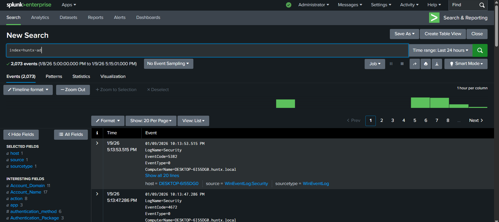
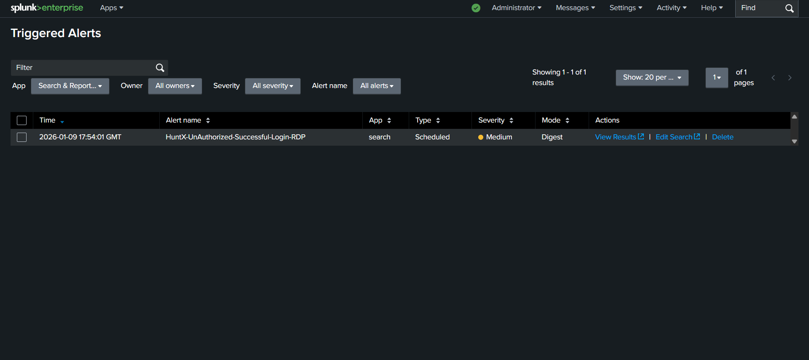
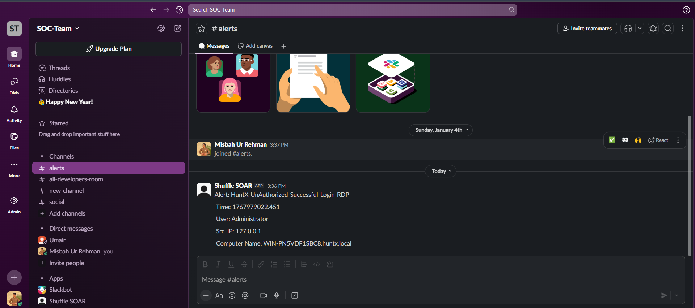
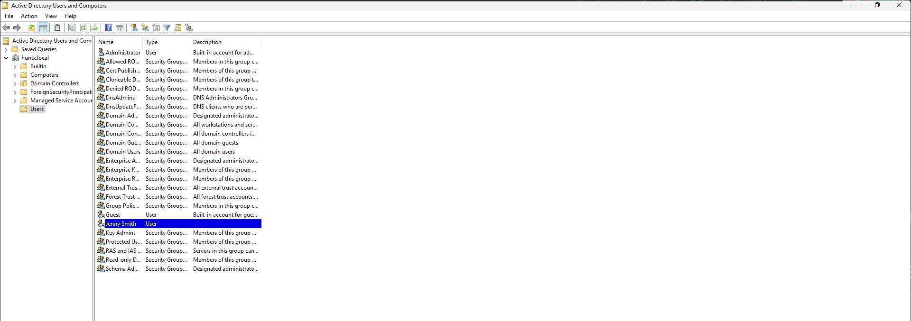

# Active Directory Security & SOAR Automation Project

## Overview

I built this project to simulate a real-world SOC Level 1 environment where identity-based threats are detected, investigated, and responded to using SIEM + SOAR automation. The project combines Active Directory, Splunk, and Shuffle.io (SOAR) to demonstrate how SOC analysts handle unauthorized login attempts with human-in-the-loop decision making.

This lab reflects how modern SOC teams automate repetitive tasks while keeping analysts in control of critical actions.


---

##  What I Built

- A Windows Active Directory domain environment
- Splunk-based detection for unauthorized login attempts
- SOAR automation using Shuffle.io
- Automated notifications via Slack & Email
- Conditional response to disable compromised user accounts

##  SOC Use Case

- Unauthorized / suspicious login attempts
- Identity-based threat detection
- Analyst-approved automated response
- Account compromise prevention

---

##  SOAR Automation Workflow (Core Feature)

This is the heart of the project - a complete automation workflow that demonstrates human-in-the-loop security automation.

### Workflow Steps

#### 1. Detection Phase
An unauthorized login alert is detected in Splunk

#### 2. SOAR Integration
The alert is automatically sent to Shuffle.io

#### 3. Notification Phase
Shuffle sends:
- A Slack alert to the SOC channel
- An email to the SOC analyst asking for approval

#### 4. Analyst Decision (Human-in-the-Loop)

**If the analyst selects YES:**
- Shuffle connects to Active Directory
- The user account is automatically disabled
- A confirmation alert is sent to Slack

**If the analyst selects NO:**
- No action is taken
- The alert is logged for monitoring

> This ensures fast response with analyst control, reducing risk from false positives.

---

##  Tools & Technologies

- **Windows Server 2025** - Domain Controller and Active Directory
- **Splunk Enterprise** - SIEM for log collection and alerting
- **Shuffle.io** - SOAR platform for automation orchestration
- **Active Directory** - Identity and access management
- **Slack** - Real-time SOC alerting and notifications
- **Email** - Analyst approval workflow
- **Windows 10** - Target endpoint for security event generation

---

##  Why This Project Matters

This project demonstrates my ability to:

- Think like a SOC analyst
- Integrate SIEM + SOAR
- Automate real SOC workflows
- Apply human-in-the-loop security automation
- Build enterprise-style security labs

---

## Step-by-Step Implementation

Below is a detailed walkthrough of each step I took to build this comprehensive Active Directory security monitoring and SOAR automation lab.

### Step 1: Network Planning & Architecture Design

I started by designing the complete lab architecture to visualize how each component would communicate. I mapped out the Domain Controller, target Windows 10 machine, Splunk server, Shuffle.io SOAR platform, and notification channels (Slack/Email) with their respective roles and data flows.


---

### Step 2: Setting Up Windows Server 2025 Domain Controller

I deployed Windows Server 2025 and promoted it to a Domain Controller. I configured Active Directory Domain Services (AD DS), created the domain, set up DNS services, and created test user accounts that would be used for monitoring and testing the automation workflow.

**Key configurations:**
- Installed AD DS role and promoted server to Domain Controller
- Configured domain name and DNS services
- Created organizational units (OUs) for better management
- Created test user accounts for security monitoring


---

### Step 3: Deploying Windows 10 Target Machine

I set up a Windows 10 machine that would serve as the target endpoint in my lab. I joined this machine to the domain, making it a realistic representation of an employee workstation in an enterprise environment. This machine would generate the security events that trigger our automation workflow.

**Implementation steps:**
- Installed Windows 10 and configured network settings
- Joined the machine to the Active Directory domain
- Created domain user accounts for testing login scenarios
- Verified domain connectivity and authentication


---

### Step 4: Installing and Configuring Splunk Enterprise

I deployed Splunk Enterprise on a separate server to serve as my SIEM. This would be the central point for collecting, analyzing, and detecting security events. I configured Splunk to receive logs from the Windows 10 target machine and set up correlation searches to detect unauthorized login attempts.

**Configuration details:**
- Downloaded and installed Splunk Enterprise
- Configured the web interface and admin credentials
- Set up receiving ports for incoming data (port 9997)
- Created indexes for organizing AD logs and security events
- Configured correlation searches for unauthorized login detection



---

### Step 5: Installing Splunk Universal Forwarder

On my Windows 10 target machine, I installed the Splunk Universal Forwarder to send Windows Event Logs to the Splunk Enterprise server. I configured it to forward Security logs, which contain authentication events that would trigger our unauthorized login detection.

**Setup process:**
- Installed Splunk Universal Forwarder on the target machine
- Configured outputs.conf to point to my Splunk server
- Set up inputs.conf to collect Security event logs
- Verified log forwarding was working properly


---

### Step 6: Creating Splunk Detection Rules

I created correlation searches in Splunk to detect unauthorized login attempts. These searches monitor for patterns like multiple failed login attempts, login attempts from unusual locations, or login attempts outside business hours. When triggered, these searches generate alerts that will be sent to Shuffle.io.

**Detection rules created:**
- Correlation searches for failed authentication attempts
- Configured alert thresholds and conditions
- Set up webhook actions to send alerts to Shuffle.io
- Tested detection rules with simulated login attempts



---

### Step 7: Setting Up Shuffle.io SOAR Platform

I deployed Shuffle.io as my SOAR platform. Shuffle.io would receive alerts from Splunk and orchestrate the automation workflow. I configured Shuffle.io to integrate with Active Directory, Slack, and Email services.

**Integration setup:**
- Deployed Shuffle.io SOAR platform
- Configured webhook receiver to accept Splunk alerts
- Set up Active Directory integration for account management
- Configured Slack API integration for notifications
- Set up Email integration for analyst approval requests


---

### Step 8: Building the SOAR Automation Workflow

This is the core of the project. I built a complete automation workflow in Shuffle.io that implements the human-in-the-loop pattern. The workflow receives Splunk alerts, sends notifications, waits for analyst approval, and then takes conditional action based on the analyst's decision.

**Workflow components:**
- Created workflow to receive Splunk webhook alerts
- Added Slack notification step to alert SOC channel
- Implemented email step to request analyst approval
- Added conditional logic based on analyst response
- Configured Active Directory action to disable user accounts
- Set up confirmation notifications after actions are taken




---

### Step 9: Configuring Slack Integration

I integrated Slack to receive real-time notifications from the SOAR workflow. The Slack channel receives alerts when unauthorized login attempts are detected, and confirmation messages when actions are taken (like account disabling).

**Slack setup:**
- Created Slack workspace and SOC alerting channel
- Generated Slack API token and webhook URL
- Configured Shuffle.io to send formatted messages to Slack
- Tested notification delivery and formatting


---

### Step 10: Setting Up Email Approval Workflow

I configured email integration to send approval requests to SOC analysts. When an unauthorized login alert is detected, the analyst receives an email with details about the alert and options to approve or deny the automated response action.

**Email workflow configuration:**
- Configured SMTP settings in Shuffle.io
- Created email template with alert details and approval buttons
- Set up email parsing to capture analyst responses
- Implemented workflow pause to wait for analyst decision


---

### Step 11: Testing the Complete Workflow

I tested the complete end-to-end workflow by simulating unauthorized login attempts. I verified that alerts were detected in Splunk, sent to Shuffle.io, notifications were delivered, analyst approval was captured, and conditional actions were executed correctly.

**Testing scenarios:**
- Simulated multiple failed login attempts on test accounts
- Verified Splunk detection and alert generation
- Confirmed webhook delivery to Shuffle.io
- Tested both approval scenarios (YES and NO responses)
- Verified Active Directory account disabling when approved
- Confirmed no action taken when request is denied




---

### Step 12: Documentation and Workflow Optimization

Finally, I documented the complete workflow, created runbooks for SOC analysts, tuned detection rules to reduce false positives, and optimized the automation workflow for better performance and reliability.

**Final deliverables:**
- Created comprehensive network and workflow documentation
- Developed SOC analyst runbooks for the automation workflow
- Tuned Splunk detection rules based on test results
- Optimized Shuffle.io workflow for performance
- Documented incident response procedures
- Created lessons learned and improvement recommendations


---

##  Key Skills Demonstrated

### Security Operations
- SOC Level 1 Incident Response
- SIEM Alert Handling
- SOAR Automation

### Identity & Access Management
- Active Directory Security
- Identity & Access Monitoring
- Security Documentation

---

##  Project Architecture

The project architecture consists of:

1. **Windows Server 2025 Domain Controller** - Manages Active Directory domain and user accounts
2. **Windows 10 Target Machine** - Generates security events and forwards logs to Splunk
3. **Splunk Enterprise** - SIEM platform that detects unauthorized login attempts
4. **Shuffle.io SOAR Platform** - Orchestrates the automation workflow
5. **Slack** - Real-time notification channel for SOC team
6. **Email** - Analyst approval mechanism

### Data Flow

```
Windows 10 → Splunk Forwarder → Splunk Enterprise → Shuffle.io → [Slack/Email] → Analyst Decision → Active Directory
```

---

##  Important Note: Lab Environment

I built and tested this in a controlled home lab environment, not in a live production SOC. The goal here is to demonstrate my understanding of SIEM + SOAR integration, human-in-the-loop automation workflows, and real-world SOC incident response processes.

In production, I would implement additional security controls, error handling, audit logging, role-based access controls, and comprehensive testing before deploying such automation workflows to protect real user accounts and systems.

---

##  Key Takeaways

Through this hands-on project, I gained practical experience in:

- **Active Directory Administration** - Setting up and managing a Windows domain environment
- **SIEM Deployment** - Configuring Splunk for security event monitoring and alerting
- **SOAR Automation** - Building human-in-the-loop automation workflows with Shuffle.io
- **Security Integration** - Connecting multiple security tools into a cohesive workflow
- **Incident Response** - Understanding real-world SOC analyst workflows and decision-making processes

This project demonstrates my ability to build, monitor, and defend enterprise environments as a SOC Level 1 Analyst while implementing modern security automation practices.

---

## 🔗 Related Resources

- [Splunk Enterprise Documentation](https://docs.splunk.com/)
- [Shuffle.io Documentation](https://shuffler.io/docs)
- [Active Directory Security Best Practices](https://learn.microsoft.com/en-us/windows-server/identity/ad-ds/plan/security-best-practices)

---

## License

This project is for educational and demonstration purposes only. All tools and technologies used are either open-source or used in a lab environment for learning purposes.

---

**Built with 💖 by** Misbah Ur Rehman  
**Role:** SOC Analyst & Next.js Developer  
**Date:** December 2025

